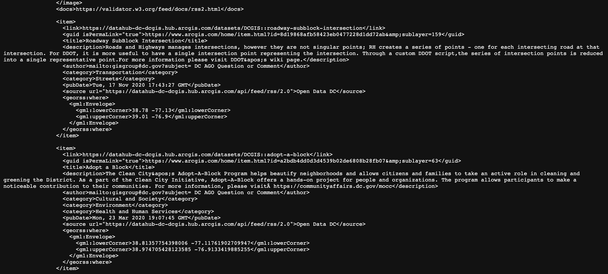
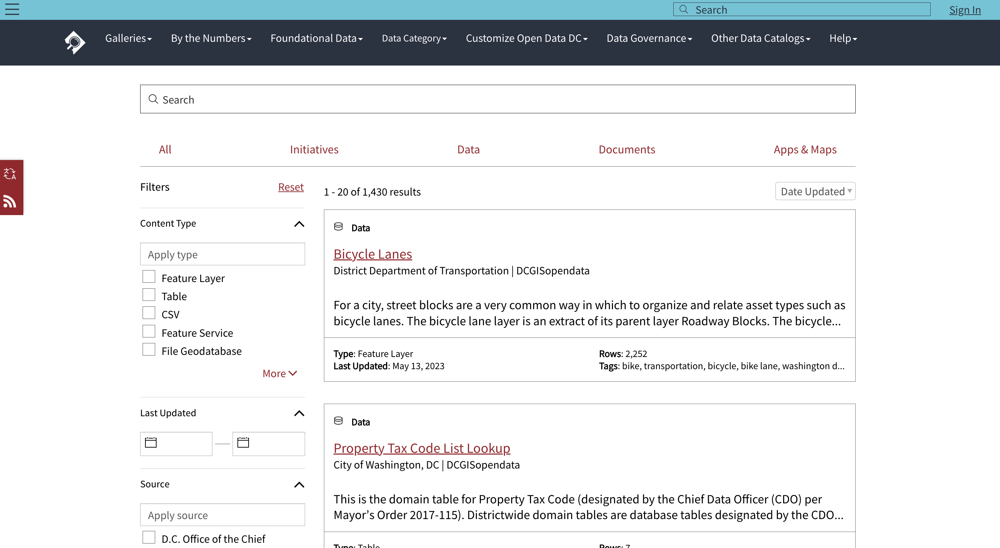
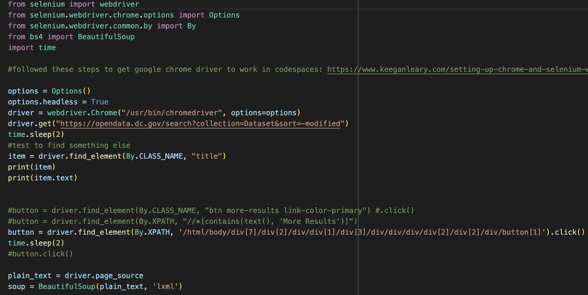

# Quirks with Selenium and using it in Codespaces
## The Python library is great for web scraping and yes, you can scrape it using cloud-based development tools. Here’s what to know before you get started.
      

**By Hanna Zakharenko**

## The Problem
When I was tasked with making a bot for a project in my news applications class, I wanted to create a bot that scraped a local source of data, [OpenDataDC](https://opendata.dc.gov/). As a data journalist, I am always looking for new pitches that originate from government databases, which are often filled with stories that might otherwise slip through the cracks. 

My goal was to grab all the datasets updated every day and send a Slack message about them. Based on these requirements, I thought that [the site’s RSS feed](https://datahub-dc-dcgis.hub.arcgis.com/api/feed/rss/2.0) would meet all my needs. However, datasets on their website are regularly updated, and the RSS feed doesn’t indicate it, but only shows the original publication date for each dataset.

While the RSS feed didn’t provide me with the core information I wanted my bot to present to me in a message (“There were X new datasets updated today! Here they are…”), it did have all the grounds I needed to build a basic dataframe with every dataset currently on the site. All I needed to collect was the “Date Updated” metadata from each one.

The only place I could find this information on the site was on [the detail card page](https://opendata.dc.gov/search?collection=Dataset&sort=-modified) that listed all of the datasets on the website in chunks of 20, and let you click a “Load More” button to get the next 20. 

I started hunting around the site using developer tools to see if there was a JSON file or any other source of data that loaded into the site to present the information. I found a [load of JSON]() that included all information on that page and also held the information within each dataset. After formatting it and observing it, it seemed too difficult to parse and get the specific information I wanted. 

So instead, I decided I’d scrape the website using [BeautifulSoup](https://www.crummy.com/software/BeautifulSoup/bs4/doc/) But when I found the unique identifier I’d need to grab and wrote some code to grab it for me, it couldn’t find anything. I learned that this is because OpenDataDC is a website that runs on ArcGIS and loads a lot of Javascript and JSON onto a webpage to gather and display. This takes a hot second to load and this information isn’t stored in the original page source, so I’d need to wait for the web page to load before I could scrape it.

Since I can’t do that with BeautifulSoup alone, I needed to incorporate [Selenium](https://www.selenium.dev/) to wait for my web page to load before scraping. Selenium would also give me the ability to click that “Load More” button in case I wanted to gather more than 20 new datasets every day.

## Setting up Selenium on Codespaces
Since I was working on my project in Codespaces, I was tasked with setting up Selenium in Codespaces as well. The reason this is more complicated than it seems is that Selenium requires you to install a browser driver for Selenium to work off of. When working in a cloud-based development environment, it is a little hard to tell where things are being installed, because it isn’t your computer. I found it tricky to find the file path for the browsers I installed and tried looking online for solutions.

I ended up closely following this tutorial in a sea of online blogs that walks you through how to set up Chrome with Selenium in Python on a virtual machine (a.k.a. Codespaces).

This tutorial downloads the web driver to your local machine and then downloads it on your virtual machine. It provides command lines to enter to adjust the settings and permissions to make your driver work.

## Selecting buttons with Selenium
Once Selenium was installed and set up, I found it relatively easy to grab the “Date Updated” metadata from BeautifulSoup by having Selenium open the page and wait a couple of seconds before scraping. However, I wanted to grab more than 20 datasets at a time, since there were regularly 20+ datasets updated per day. Therefore, I thought I’d try to click the button using the same method, grab it from a unique selector and click it. Selenium had a tool designed for this, `driver.find_elements()`. 

But Selenium could not find my button using the button’s unique class. So, I tried to grab it from the parent element, which didn’t work either. I also tried using the relative xpath, but that returned no results as well. At this point, I was very frustrated that Selenium couldn’t find this button, so I went to my good friend ChatGPT to ask a question:

"I'm trying to find a button element on a webpage using Selenium and Python. It has a unique class name and xpath, and I've tried to find the element using both of these methods, but it can't find it. What other workarounds are there?"

The workarounds that ChatGPT suggested were to wait longer, wait until the button was clickable or appeared on the webpage, find the element by ID, use the xpath, or try switching to an iframe (in case the element I was looking for was inside an iframe). 

After trying all of these methods, I eventually put in the full xpath instead of the relative xpath, and Selenium was finally able to find the button.

## Conclusion
I'm still not entirely sure why this was the only solution for me to find the button, but I learned a problem-solving process for something when you are certain that your code is right and it still isn’t working.

Even though I was confident that the button was there and had a unique class, I tried every method I found online to solve the problem. I tried grabbing the button using different methods and had Selenium wait for longer to let the webpage fully load. When I finally found what worked, I registered it as a promising solution and will probably choose to use it as the first thing I try next time I have an issue with Selenium.

Overall, Selenium helped me grab what I needed from the website I was scraping, but not necessarily in the most efficient and effective way.

This is a great method if you want to scrape something from a website that has a complicated loading setup but don't have the time to figure out how it works to grab the information you need. It is also relatively easy to set up in Codespaces and have something running every day without weighing down your local computer.

